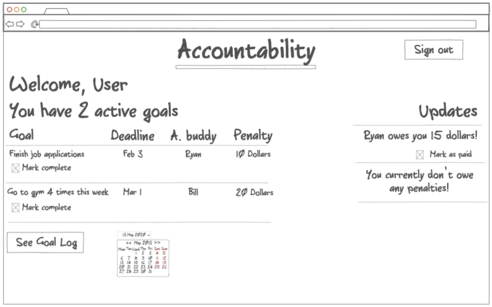

# Acountability

## Design

We’ve all been in a situation where we weren’t as productive as we could have been. Maybe you set a deadline to finish something but didn’t reach your goal because Netflix was more enticing. After all, no one else was holding you to your commitment. Enter Accountability, a peer-to-peer website where you share your goals with a friend, along with a monetary penalty. If you don’t complete your goal by the deadline, you owe your friend the penalty you set!!

Key features

- Secure login over HTTPS
- Add and save your goals
- Set an accountability buddy for each goal
- Buddies are notified when you complete/fail a goal
- Set your own penalty for each goal

Update Feb 8
When trying to upload my simon site to a subdomain, I copied the deployFiles.sh from the example code online. However, it didn't let me run it. I looked on stack overflow and found a command to run -- chmod +x deployFiles.sh -- and afterwards, it worked. I'm not quite sure what that did but it would be good to remember it.

Update Feb 21
After the Simon css project, I feel like I understand bootstrap a little better but I still need more practice. I'm also hoping I didn't set too high of a goal for my startup. I think the best way to go about it is have a clear goal/vision in mind and find how to achieve that goal in the absolute simplest way possible.

Update Feb 24
I'm happy with how the HTML and CSS looks, I think it matches my vision really well. I know I'll have to change how I did the CSS and bootstrap stuff, I didn't even make a separate file for style. I'll have to update that.

Update March 6
I feel like even the basic SIMON javascript takes a lot of code for something relatively simple. Fortunately, JS is pretty similar to C++ so I don't think I'll be too lost but hopefully I'll be able to apply what I learned to my startup. I think how the SIMON application maintains and updates the scoring table will carry over really well to what I'm trying to do with my website.

Update March 11
Wow so I really despise Javascript. Not really, I think I just haven't given myself enough time to fully learn it but its getting better. I particularly find manipulating the DOM tricky, but found for some reason I learned that I need to use [0] after the variable I call getElementsByClassName from. 